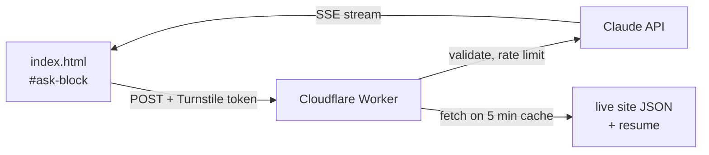

# gamedevtc.github.io — Taylor Christianson's Portfolio

A single-page, data-driven game-development portfolio hosted on **GitHub Pages** at
**https://gamedevtc.github.io**.

Almost everything on the page (projects, experience, profile, skills) is read at runtime from
**JSON data files** — so adding a project or updating a bio is an edit to a `.json` file, not the
HTML. This README documents how the site is put together and, most importantly, **how to add or edit
content by hand**.

> Originally built on the HTML5 UP "Read Only" template, but heavily customized since — the app-store
> project grid, the terminal-style Experience section, the JSON data layer, dark mode, and the social/
> store link pills are all bespoke. See **Credits & License** at the bottom.

---

## How it works (the 30-second version)

- **Static site.** Plain HTML + CSS + JS. No build step is needed to change content — you edit JSON.
- **`index.html`** holds all the markup, styles, and JavaScript (it's one big file). On load, its JS
  `fetch()`es the JSON data files and builds the page.
- **Content lives in JSON:** `games.json`, `experience.json`, `profile.json`, and one
  `slides.json` per project.
- **Deploy = push to `main`.** GitHub Pages serves the repo root. Changes are live within a minute.

### Page sections

| Section | Nav label | What it is |
|---|---|---|
| `#one`   | About     | Top card: portrait, name, role, degree, auto-computed **YRS EXP** + **PROJECTS** stats, and the bio blurb. Driven by `profile.json` (+ `experience.json` for the stats). |
| `#two`   | Projects  | App-store-style icon grid built from `games.json`. Click a game to open a detail sheet with its tags, link pills, roles, description, and an image/video/YouTube slideshow (`slides.json`). |
| `#three` | Experience | Terminal-style résumé: experience, education, and skills from `experience.json`, plus the Résumé and Letter-of-Reference download buttons. The **Ask Me** assistant terminal sits at the top of this section — see [The Ask Me assistant](#the-ask-me-assistant). |

---

## Repository layout

```
/
├── index.html              ← all markup, CSS, and JS (single file)
├── games.json              ← the Projects grid (array of game objects)
├── experience.json         ← work / education / skills (Experience section)
├── profile.json            ← name, title, bio, portrait, social links, résumé path
├── assistant.json          ← Ask Me assistant: kill switch, worker endpoint, UI copy
├── .gitattributes          ← Git LFS rules for archived videos (see "Media & video")
├── downloads/              ← résumé + letter of reference (PDFs)
├── videos/                 ← site banner video
├── images/
│   ├── experience/         ← studio / school logos (halfbrick.png, panda-paw.png, fullsail.png …)
│   └── projects/<id>/      ← one folder per game (id must match games.json "id")
│       ├── slides.json     ← thumb, background, and the slideshow for that game
│       ├── <id>-thumb.png  ← grid/card thumbnail
│       ├── *.png / *.mp4   ← gallery media (served)
│       └── stored/         ← archived media too big to serve (Git LFS, NOT shown on the site)
└── assets/                 ← template CSS/JS, Font Awesome 6.5.2 (css + webfonts), Sass sources
```

---

## Data file reference

### `games.json` — the Projects grid

An **array** of game objects, shown in array order (top of the array = first card). Fields:

| Field | Type | Notes |
|---|---|---|
| `id` | string | **Required.** Must match the folder name in `images/projects/<id>/`. Used to find the thumbnail and slides. |
| `name` | string | Display title on the card and detail sheet. |
| `year` | string | e.g. `"2026"` or `"2023–2026"`. Shown on the card and next to `meta`. |
| `meta` | string | Studio / context line, e.g. `"Panda Paw Entertainment"`. |
| `tags` | string[] | Tech/skill pills (row 1 of the detail sheet). |
| `roles` | string[] | Your roles on the project (rendered as role pills). |
| `desc` | string | One-paragraph description. |
| `bullets` | string[] | Highlight bullet points. |
| `links` | object[] | Store/social pills (row 2). Each is `{ "type": "...", "url": "..." }`. See **Link types** below. Omit if none. |
| `experience` | string \| object | Ties the card to a studio. A **string** matches an `id` in `experience.json` (shows that studio's logo + name). An **object** `{ "label", "image?", "url?" }` is a one-off link. Omit for none. |
| `badge` | bool \| string | `true` shows a small "notification dot" on the icon; a string shows that text as a badge. Omit for none. |

**Link types** (the `type` in each `links` entry) map to a brand icon + colour automatically:
`steam`, `youtube`, `discord`, `twitter`, `x`, `instagram`, `tiktok`, `twitch`, `itch`, `bluesky`,
`website`. An unknown type falls back to a generic link icon. You can override per-link with an
optional `"label"` or `"icon"` (a Font Awesome class, e.g. `"fab fa-steam"`).

<details>
<summary>Minimal game entry template (copy/paste)</summary>

```json
{
  "id": "my-game",
  "name": "My Game",
  "year": "2026",
  "meta": "Studio Name",
  "tags": ["Unity 6", "C#", "PC"],
  "roles": ["Gameplay Programmer"],
  "desc": "One-paragraph description of the project.",
  "bullets": [
    "A notable thing I built",
    "Another notable thing"
  ],
  "links": [
    { "type": "steam", "url": "https://store.steampowered.com/app/…" }
  ],
  "experience": "panda-paw"
}
```
</details>

### `slides.json` — one per project (`images/projects/<id>/slides.json`)

Controls the card thumbnail and the detail-sheet slideshow.

```json
{
  "thumb": "images/projects/my-game/my-game-thumb.png",
  "background": "images/projects/my-game/my-game-background.png",
  "slides": [
    { "type": "image",   "src": "images/projects/my-game/shot-1.png", "alt": "" },
    { "type": "video",   "src": "images/projects/my-game/clip-1.mp4", "alt": "" },
    { "type": "youtube", "src": "VIDEO_ID",                            "alt": "Trailer" }
  ]
}
```

- `type: "image"` / `"video"` → `src` is a path in the repo.
- `type: "youtube"` → `src` is just the **YouTube video ID** (the part after `watch?v=`). Best choice
  for anything large — see **Media & video** below.

### `experience.json` — Experience section

Three arrays: `work`, `education`, `skills`.

- **work[]**: `{ id, company, image, roles[], date, startDate, endDate?, status?, progression[] }`
  - `startDate`/`endDate` are `"YYYY-MM"` and feed the auto-computed **YRS EXP** stat. Omit `endDate`
    to count a role as ongoing (to "now").
  - `status` (optional) renders a small badge next to the company name, e.g. `"Furloughed"`.
  - `progression[]` is the role timeline: `{ title, startDate, endDate?, date, promoted? }`.
    `promoted: true` adds an "↑ promoted" marker.
- **education[]**: `{ id, school, image, degree, graduated }`.
- **skills[]**: `{ key, value }` (rendered as a `"key": value` list).

The `id` on a work/education entry is what a game's `experience` string points at.

### `profile.json` — About card + sidebar

`{ name, title, tagline, roles[], image, bio, email, links[], resume, reference }`

- `title` is the role line on the **About card** (`#one`).
- `tagline` + `roles[]` drive the **sidebar** subheader under your name — `tagline` on the first line,
  `roles` joined with " • " on the second (e.g. `["Programmer","Designer","Team Lead"]`).
- `bio` is an **array of sentences**, joined with spaces into one paragraph. Keep specific numbers
  (years, project counts) **out** of it — those are shown as auto-computed stats.
- `links[]`: `{ label, url, icon, newTab }` (`icon` is a Font Awesome class like `"brands alt fa-github"`).
- `resume` and `reference` are paths to PDFs in `downloads/` — they populate the Résumé and
  Letter-of-Reference download buttons in the Experience section.

---

## The Ask Me assistant

The terminal at the top of the Experience section is a Claude-powered assistant that answers
recruiter questions about Taylor. It is the one part of this site that is **not** self-contained.

> **The backend is not in this repo.** It lives in the private repo
> [`gamedevtc/portfolio-assistant`](https://github.com/gamedevtc/portfolio-assistant), locally at
> `D:\Personal Projects\Portfolio\portfolio-assistant`. Nothing here points to it except the
> `endpoint` URL in `assistant.json`, so it is easy to miss.

### Why it is split

GitHub Pages is static, so the page cannot call the Claude API directly: an API key in client JS is
visible in view-source and gets scraped within days. A Cloudflare Worker holds the key instead.

That worker also bundles `assistant-kb.md`, the file that tells the assistant how to answer sensitive
questions (the furlough, weaknesses, salary, what never to claim). GitHub Pages serves every
committed file and **this repo is public**, so that file cannot live here. It sits in the private
repo and is compiled into the worker at deploy time.

### What lives where

| Change | Repo | How it ships |
|---|---|---|
| Site content, projects, résumé data | this one | `git push` |
| What the assistant **says** (`assistant-kb.md`) | `portfolio-assistant` | `npx wrangler deploy` |
| Worker code, rate limits, model choice | `portfolio-assistant` | `npx wrangler deploy` |
| Whether the assistant is visible at all | this one (`assistant.json`) | `git push` |

**Pushing to this repo will not change what the assistant says.** That is the single most common
mistake available here.

### Request flow



The worker assembles its system prompt from the bundled `assistant-kb.md` plus four files fetched
from the **live site**: `downloads/Resume-Content.md`, `experience.json`, `games.json` and
`profile.json`. So project and résumé edits here reach the assistant automatically within about five
minutes, with no redeploy. Contact details are stripped from that material before the model sees it.

### `assistant.json`

| Field | Meaning |
|---|---|
| `enabled` | Master switch. The section stays hidden unless this is `true` **and** `endpoint` is set |
| `endpoint` | Worker base URL. Empty means hidden, regardless of `enabled` |
| `turnstileSiteKey` | Cloudflare Turnstile site key. Empty disables the bot check client-side |
| `terminalTitle`, `command`, `intro`, `suggestions`, `disclaimer` | Visible UI copy |
| `maxChars`, `maxTurns` | Client-side caps; the worker enforces its own regardless |

There is a **second kill switch** in the worker (`ASSISTANT_ENABLED`) that makes the endpoint refuse
everything with a 503. Use that one if the endpoint is being abused, since it takes effect without
waiting on a Pages rebuild.

### Testing without going live

Add `?assistant=preview` to the site URL. The terminal appears with an amber "preview mode" flag
even when `enabled` is `false`, so it can be tested on the real site, through the real Turnstile
flow, while remaining invisible to ordinary visitors.

---

## Adding a new project (checklist)

1. **Pick an `id`** (kebab-case, e.g. `my-game`).
2. **Add an entry** to `games.json` (see the template above). Position in the array = position in the grid.
3. **Create `images/projects/<id>/`** and add:
   - `<id>-thumb.png` (the card thumbnail),
   - a `slides.json` (thumb + background + slides),
   - the gallery images/videos it references.
4. If you set `"experience": "<id>"`, make sure that `id` exists in `experience.json` and its logo is
   in `images/experience/`.
5. **Preview locally** (see below), then commit + push.

---

## Media & video — important

**GitHub Pages does not serve Git LFS files** (it serves the tiny pointer text instead), and GitHub
**blocks any file over 100 MiB** and warns over 50 MiB. So videos are split by size:

- **≤ 50 MiB → normal Git.** Keep it in the project folder, reference it in `slides.json`
  (`type: "video"`). It's served and plays on the live site.
- **> 50 MiB → not served.** Move it into the project's **`stored/`** folder, **remove it from
  `slides.json`**, and let Git LFS track it (archive/backup only — it will *not* play on the site).
  To actually show a big video, **host it on YouTube and use `type: "youtube"`** instead.

`.gitattributes` tracks only archived videos, so nothing the site serves is ever turned into an LFS
pointer:

```gitattributes
**/stored/*.mp4  filter=lfs diff=lfs merge=lfs -text
**/stored/*.mov  filter=lfs diff=lfs merge=lfs -text
**/stored/*.webm filter=lfs diff=lfs merge=lfs -text
```

> Commit large `stored/` videos through a client that has Git LFS (e.g. GitHub Desktop), and commit
> `.gitattributes` before/with them so the LFS filter applies.

---

## Local preview

The page loads its data with `fetch()`, which browsers **block over `file://`** — opening
`index.html` directly will show an empty projects grid. Serve it over HTTP instead:

```bash
# from the repo root
python3 -m http.server 8000
# then open http://localhost:8000
```

(VS Code's "Live Server" extension works too.)

---

## Deployment

GitHub Pages serves the repo root of `gamedevtc.github.io` on push to **`main`**. No build step.
After pushing, allow ~1 minute and hard-refresh (Pages/CDN caching).

> **Line endings:** the working tree is CRLF while Git stores LF, so a fresh checkout may show large
> "every line changed" diffs on text files. It's cosmetic (doesn't affect the site); a one-time
> `.gitattributes` normalization pass would clean it up if it ever gets annoying.

---

## Tech stack

- Static **HTML / CSS / JavaScript** (vanilla + jQuery from the original template).
- **Font Awesome 6.5.2** (self-hosted in `assets/`; brand icons power the link pills).
- **Fira Code** (Google Fonts) for the terminal-style Experience section.
- **GitHub Pages** hosting; **Git LFS** for archived video.
- **Cloudflare Workers** + the **Claude API** behind the Ask Me assistant, in a separate private
  repo (see [The Ask Me assistant](#the-ask-me-assistant)).

---

## Credits & License

Built on the **"Read Only"** template by **HTML5 UP** (https://html5up.net · @ajlkn), used under the
**Creative Commons Attribution 3.0** license — full text in [`LICENSE.txt`](LICENSE.txt). Per that
license, this attribution is retained.

Bundled third-party components:

- **Font Awesome** — icons (https://fontawesome.com)
- **jQuery** — https://jquery.com
- **Scrollex** — https://github.com/ajlkn/jquery.scrollex

All portfolio content — text, project data, and images/video under `images/`, `videos/`, and
`downloads/` — © Taylor Christianson. Game screenshots and trailers remain the property of their
respective studios (Halfbrick Studios, Panda Paw Entertainment) and are shown as portfolio work.
